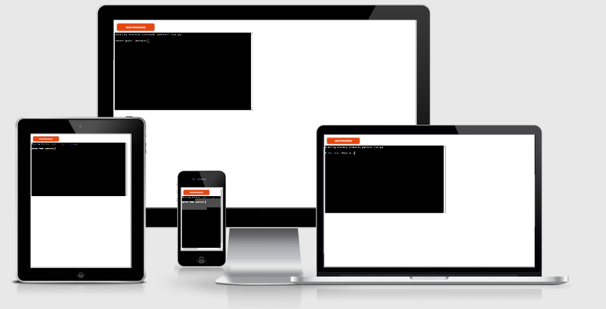
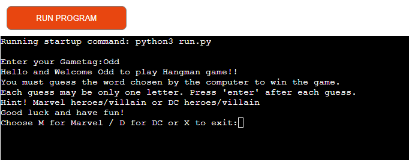
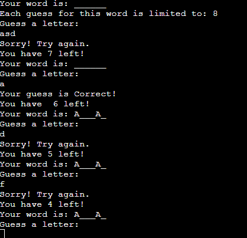
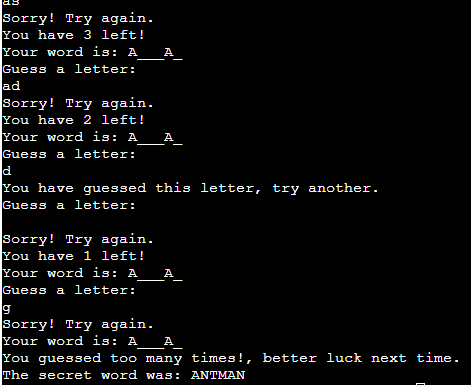

# Hangman Game!
It is a game of hangman about Marvel Heroes and DC Heroes that you play against the computer.  

If you can guess the right heroes/villains with one letter before you run out of guesses, you win,  
In the event that you lose, you can try again if you are victorious against the computer

# How to play
A computer, the "host," creates/generate a secret word,  
Then YOU try to guess the word by asking what letters are in it.  
Every wrong guess, however, puts them one step closer to losing and  
Each right guess brings them closer to winning
You win if all your guesses are correct

# Features
- __Choose category__
  * You can Choose 2 different category
  * Computer generate different Hero/villain

- __Show how many chance you have left__
  * Every guessed letter show how many chances you have left
  * Tell you if you have guessed right or wrong
  * How many you had from the beginning

- __The Result__
  * Tell if you have already guess same letter
  * Tell you what word you have get at the end
  * Tell if you win or lose and the secret word

 

- __The Reset Button__
  * You can reset the score and the game by pressing the reset button

   

# Futures implement
  * I want to add time limit and seee how many points you can get

# Typography and color scheme
  * Color: white and blue   

# wireframes
- __wireframes desktop__

- __wireframes phone__

# Technology
- Wireframes for layout on desktop and mobile in Balsamiq tools.
- This site was laid out and structured using HTML.
- Style and appearance using CSS.
- Javascript for game.
- Use Github to deploy the project and read the README.
- Gitpod is used for coding.
- CodeInstuite project, YouTube, and Google for tutorials and troubleshooting.
- Skype for contact with the mentor for tips and advice. 
- jigsaw, W3c and lighthouse for testing and troubleshoot.

# Testing

- I tested this game on Microsoft edge and Chrome and it seems to works great.
- The game is playable on desktops, iPads, and phones when I tested.
- I can confirmed the game is working fine.
- Each rock, paper, and stone button works fine on mobile and desktop
- The reset button works and resets the game and refreshes the site
- I confirmed the games were easy to understand and play

# Bugs
- Didnt get the inner messsage to work was missing a .

- But after google and searching figured out and add the . and everything worked

# Unfixed Bugs
No Unfixed Bugs

# Validator Testing

HTML
- No Error on the official [w3c HTML Validator](https://validator.w3.org/nu/?doc=https%3A%2F%2Fblandaren123.github.io%2FRock-paper-scissor%2Findex.html)

CSS
- No Error on the official [jigsaw CSS validator](https://jigsaw.w3.org/css-validator/validator?uri=https%3A%2F%2Fblandaren123.github.io%2FRock-paper-scissor%2Findex.html&profile=css3svg&usermedium=all&warning=1&vextwarning=&lang=en)

Accessbility
- It's confirmed that the colors and fonts chosen are readable in devtools when tested through Lighthouse

# Deployment
- This site was published through GitHub pages. To promote the site, follow these steps:
1. In the GitHub repository, navigate to the Settings tab
2. From the source section drop-down menu, select the Main Branch
3. When the main branch is selected, a detailed ribbon display will show to indicate the successful deployment.

Here is the link [Rock Paper Scissor](https://blandaren123.github.io/Rock-paper-scissor/index.html)

# Credits

Contents 
- How to create function and badge for rock paper scissor from youtube [here](https://www.youtube.com/watch?v=Qqy8Ov3NWvQ)
- Taken some code from [Codepen.io](https://codepen.io/nicolarb/pen/PoYvamR) and remake it!

Media
- The image for button and about was taken from Wikipedia [Rock](https://en.wikipedia.org/wiki/Rock_paper_scissors#/media/File:Rock-paper-scissors_(rock).png) [paper](https://en.wikipedia.org/wiki/Rock_paper_scissors#/media/File:Rock-paper-scissors_(paper).png) [Scissor](https://en.wikipedia.org/wiki/Rock_paper_scissors#/media/File:Rock-paper-scissors_(scissors).png)

