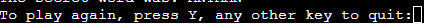
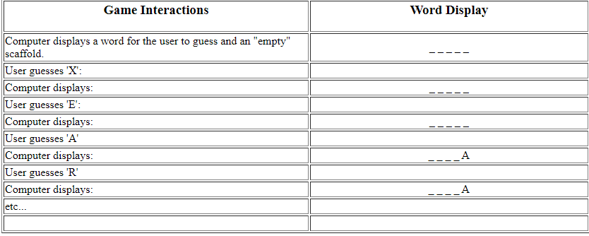
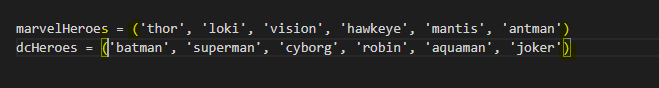
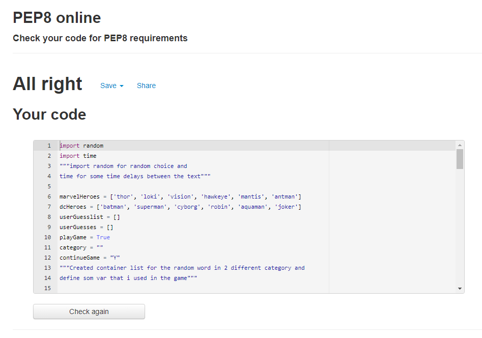

# Hangman Game!
It is a game of hangman about Marvel Heroes and DC Heroes that you play against the computer.  

If you can guess the right heroes/villains with one letter before you run out of guesses, you win,  
In the event that you lose, you can try again if you are victorious against the computer

# How to play
A computer, the "host," creates/generate a secret word,  
Then YOU try to guess the word by asking what letters are in it.  
Every wrong guess, however, puts them one step closer to losing and  
Each right guess brings them closer to winning
You win if all your guesses are correct

# Features
- __Choose category__
  * You can Choose 2 different category
  * Computer generate different Hero/villain

- __Show how many chance you have left__
  * Every guessed letter show how many chances you have left
  * Tell you if you have guessed right or wrong
  * How many you had from the beginning

- __The Result__
  * Tell if you have already guess same letter
  * Tell you what word you have get at the end
  * Tell if you win or lose and the secret word

 

- __Play again__
  * A choose if you want to play again or exit when the games are done

  
   

# Futures implement
  * More category to choose between
  * Build in score board that shows how many times you or computer win
  * Picture of hangman with detail of when you guess wrong letter

# Data model
   

# Testing

- Tested the code through PEP8 without any problem
- tested the game on Heroku terminal and it working fine
- I confirmed the games were easy to understand and play

# Bugs
- Took a while to realise that made the container with() instead of []

 

- But after google and searching figured out and change the () to [] and everything worked.

# Unfixed Bugs
No Unfixed Bugs

# Validator Testing
- PEP8 no error
 

# Deployment
- This site was published through GitHub pages. To promote the site, follow these steps:
1. In the GitHub repository, navigate to the Settings tab
2. From the source section drop-down menu, select the Main Branch

- Project through heroku terminal
1. Go to Heroku.com and log in
2. Create App and give it a name
3. Go to Settings and go to Config Vars and set KEY:port and Value:8000 and ADD
4. add buildpack first Heroku/python and then Heroku/nodejs
5. then go to Deploy and choose deployment method and choose github
6. app connected and Choose your repository and Connect
7. Go down to Manual deploy and klick Deploy Branch 
8. klick view!!

Here is the link [HANGMAN GAME](https://hangman2odd.herokuapp.com/)

# Credits

Contents 
- How to create function and badge for rock paper scissor from youtube [here](https://www.youtube.com/watch?v=Qqy8Ov3NWvQ)
- Taken some code from [Codepen.io](https://codepen.io/nicolarb/pen/PoYvamR) and remake it!

Media
- The image for button and about was taken from Wikipedia [Rock](https://en.wikipedia.org/wiki/Rock_paper_scissors#/media/File:Rock-paper-scissors_(rock).png) [paper](https://en.wikipedia.org/wiki/Rock_paper_scissors#/media/File:Rock-paper-scissors_(paper).png) [Scissor](https://en.wikipedia.org/wiki/Rock_paper_scissors#/media/File:Rock-paper-scissors_(scissors).png)

